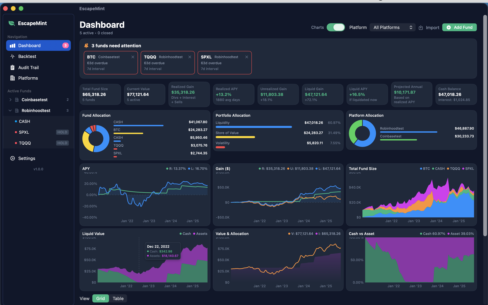
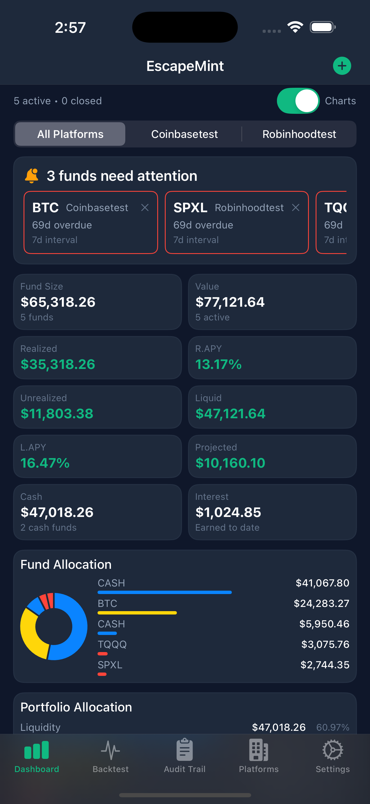
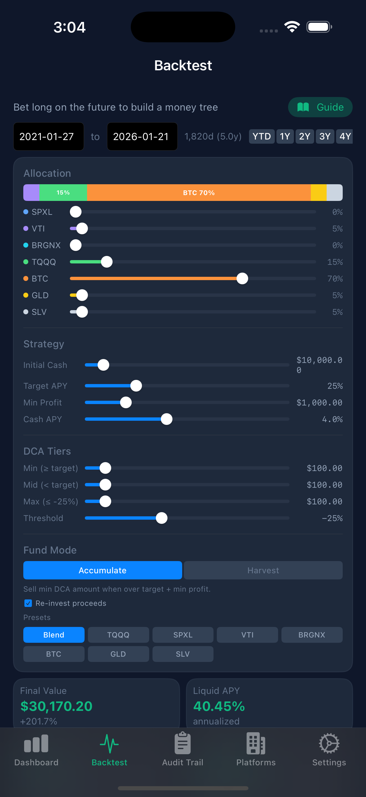
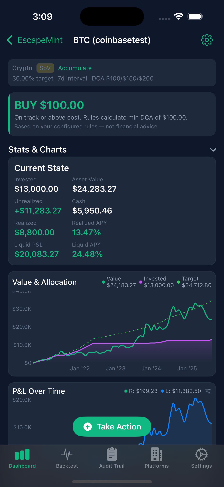
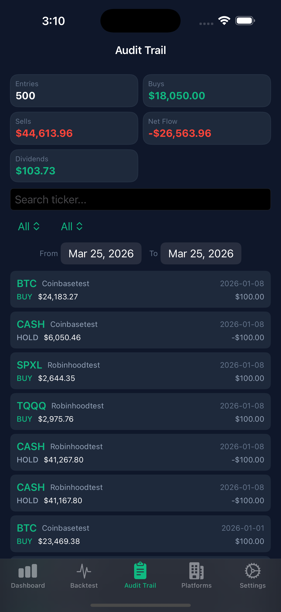
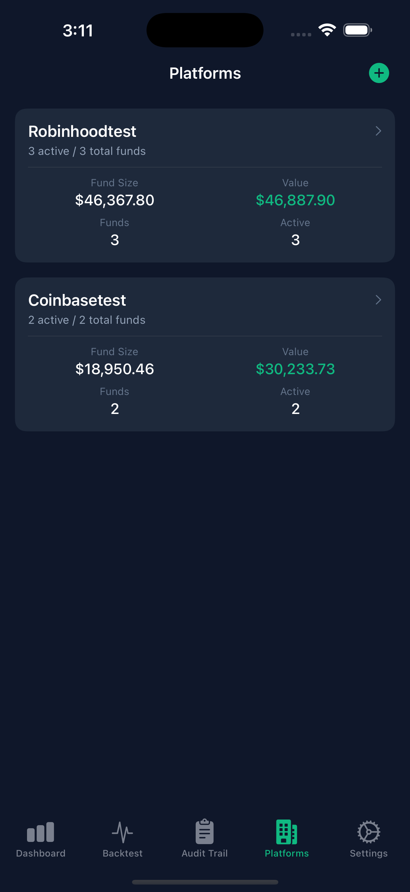
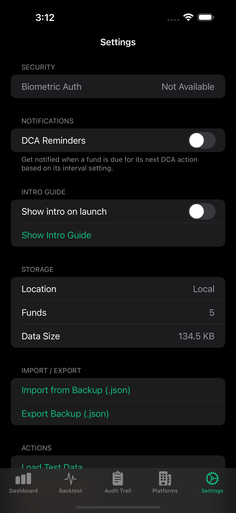

# EscapeMint

**Native SwiftUI portfolio tracker for iPhone, iPad, and Mac.** Rules-based DCA tracking, per-fund recommendations, historical backtesting. No accounts, no ads, no server — your data stays in iCloud Documents or on-device.

🌐 **[escapemint.shadowpuppet.net](https://escapemint.shadowpuppet.net)** — marketing page and feature overview

<p align="center">
  <a href="https://apps.apple.com/us/app/escapemint/id6760598547">
    
  </a>
</p>

---

## Why free?

I built this so my kid could manage their investments using the allocation algorithm I've been running on my own portfolio for years. I don't charge for it because **the algorithm works**.

Anyone selling finance software is making money from *you* — subscription fees, affiliate referrals, data brokering. Not from a system that actually builds wealth. If their system worked, they wouldn't need your $9.99/month.

EscapeMint has no Pro tier, no "unlock full features", no ads, no analytics, and no account to sign up for. The algorithm is here, the code is here, the app is free. Use it, fork it, send a PR.

## Screenshots

<p align="center">
  
</p>

<p align="center">
  
  
  
</p>
<p align="center">
  
  
  
</p>

## Features

- **Rules-based DCA recommendations** per fund — buy more when below target APY, harvest when above, hold through the dead zone
- **Backtesting** across multi-asset allocations with historical price data (BTC, TQQQ, SPXL, VTI, BRGNX, GLD, SLV)
- **Aggregate portfolio metrics** — realized + unrealized gains, APY, allocation drift, daily change
- **Per-fund detail** with 4 chart types (equity, price, APY, gain)
- **Derivatives support** — margin, liquidation detection, leveraged positions
- **Audit trail** across all entries, searchable and filterable
- **iCloud Documents sync** across devices (macOS ↔ iPad ↔ iPhone) or fully local
- **Manual entry** — you own the data, same TSV+JSON format as the [EscapeMint web app](https://github.com/atomantic/EscapeMint) for portability
- **Widgets + notifications** — portfolio value at a glance, DCA reminders when an interval hits
- **Biometric lock** (Face ID / Touch ID) on the app
- **Free forever.** No Pro features. No IAP. No analytics.

## Install

**End users:** grab it from the App Store ↑

**Developers:** keep reading ↓

---

## Build from source

### Requirements

- macOS with Xcode 16.0+
- Swift 6.0 (bundled with Xcode 16)
- iOS 17.0+ / macOS 14.0+ deployment target
- [XcodeGen](https://github.com/yonaskolb/XcodeGen) — `brew install xcodegen`

### Quick Start

```bash
git clone https://github.com/atomantic/EscapeMint-Swift.git
cd EscapeMint-Swift
xcodegen generate
open EscapeMint.xcodeproj
```

From Xcode: pick **EscapeMint_iOS** or **EscapeMint_macOS** in the scheme picker and hit ▶.

### Command line

```bash
# Build (iOS simulator, no signing)
xcodebuild build \
  -project EscapeMint.xcodeproj \
  -scheme EscapeMint_iOS \
  -destination 'platform=iOS Simulator,name=iPhone 17 Pro' \
  -configuration Debug \
  CODE_SIGNING_ALLOWED=NO \
  -quiet

# Build (macOS)
xcodebuild build \
  -project EscapeMint.xcodeproj \
  -scheme EscapeMint_macOS \
  -destination 'platform=macOS' \
  -configuration Debug \
  CODE_SIGNING_ALLOWED=NO \
  -quiet

# Run tests (macOS — fastest)
xcodebuild test \
  -project EscapeMint.xcodeproj \
  -scheme EscapeMint_macOS \
  -destination 'platform=macOS' \
  -configuration Debug \
  CODE_SIGNING_ALLOWED=NO
```

CI runs iOS + macOS tests on every PR — see `.github/workflows/ci.yml`.

## Project layout

```
EscapeMint/
  App/            App entry, Info.plist, entitlements, assets
  Engine/         Pure-function math (FundEngine, BacktestEngine, Converters)
  Models/         FundTypes, FundTypeConfig, AppStorageKeys
  Storage/        FundStore (actor I/O), FundDataStore (MainActor state), iCloud sync
  Services/       Notifications, widget snapshot, auth, Spotlight indexer
  Theme/          Colors, formatters, platform modifiers
  Views/          All SwiftUI — Dashboard, FundDetail, Backtest, Settings, etc.
EscapeMintTests/  XCTest suite (run on both iOS and macOS)
EscapeMintWidget/ WidgetKit extension (iOS only)
```

`project.yml` is the source of truth — `EscapeMint.xcodeproj` is regenerated from it by XcodeGen.

## Contributing

PRs welcome. See [CONTRIBUTING.md](CONTRIBUTING.md) for the short version and [PLAN.md](PLAN.md) for the current roadmap and known issues.

## License

[MIT](LICENSE). Go wild.
